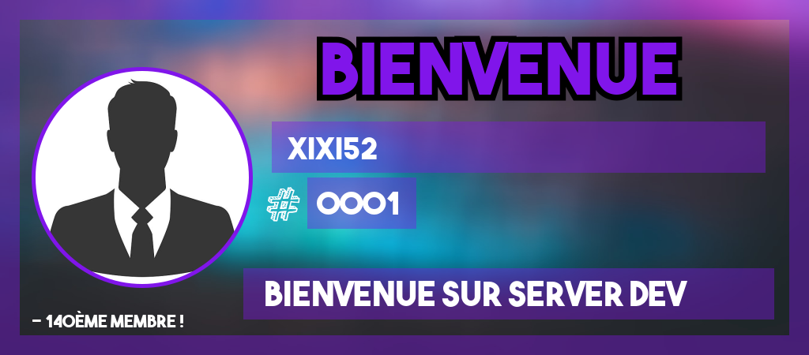

# Welcome

## Exemple

Voici un exemple des customisations possibles:



```javascript
const canvas = require("discord-canvas"),
  welcomeCanvas = new canvas.Welcome();

let image = await welcomeCanvas
  .setUsername("xixi52")
  .setDiscriminator("0001")
  .setNumber("140")
  .setServer("Server DEV")
  .setAvatar("https://cdn.craftburg.net/stockage/img/discord/avatar.jpg")
  .setColor("border", "#8015EA")
  .setColor("username-box", "#8015EA")
  .setColor("discriminator-box", "#8015EA")
  .setColor("message-box", "#8015EA")
  .setColor("title", "#8015EA")
  .setColor("avatar", "#8015EA")
  .setBackground("https://cdn.craftburg.net/stockage/img/discord/background.jpg")
  .setText("title", "bienvenue")
  .setText("message", "bienvenue sur {server}")
  .setText("number", "- {number}ème membre !")
  .toAttachment();
  
let attachment = new Discord.Attachment(image.toBuffer(), "welcome-image.png");

message.channel.send(attachment);
```


 Vous pouvez bien-sûr entrer vos propres variables

```javascript
.setUsername("xixi52")
```

Vous pouvez utiliser par exemple:

```javascript
.setUsername(message.author.username)
```


## Fonctions

Voici la liste complète des fonctions disponibles:

### `.setUsername`

Affiche le pseudo de l'utilisateur Discord

```javascript
.setUsername(variable)
```

### `.setDiscriminator`

Affiche le discriminateur de l'utilisateur Discord

```javascript
.setDiscriminator(variable)
```

### `.setAvatar`

Affiche l'avatar de l'utilisateur Discord, vous devez utiliser un URL

```javascript
.setDiscriminator(URL)
```

### `.setNumber`

Affiche le nombre d'utilisateurs dans le serveur

```javascript
.setDiscriminator(variable)
```

### `.setBackground` _\(_optionnel_\)_

Affiche un fond d'écran sur l'image, vous devez utiliser un URL

```javascript
.setBackground(URL)
```

### `.setText` _\(_optionnel_\)_

Vous pouvez traduire ou modifier le texte


Vous devez conserver les variables {server} et {number}


```javascript
.setText("title", "bienvenue")
.setText("message", "bienvenue sur {server}")
.setText("number", "- {number}ème membre")
```

### `.setColor` _\(optionnel\)_

Vous pouvez modifier les couleurs de tous les éléments de l'image

```javascript
.setColor("title", "#ffffff") // WELCOME
.setColor("title-border", "#ffffff") // WELCOME BORDER
.setColor("avatar", "#ffffff") // CIRCLE
.setColor("username", "#ffffff") // USER
.setColor("username-box", "#ffffff") // USER BACKGROUND
.setColor("ashtag", "#ffffff") // # COLOR
.setColor("discriminator", "#ffffff") // USER DISCRIMINATOR
.setColor("discriminator-box", "#ffffff") // DISCRIMINATOR BACKGROUND
.setColor("message", "#ffffff") // WELCOME MESSAGE
.setColor("message-box", "#ffffff") // WELCOME MESSAGE BACKGROUND
.setColor("number", "#ffffff") // NUMBER MESSAGE
.setColor("background", "#ffffff") // BACKGROUND COLOR
.setColor("border", "#ffffff") // BORDER COLOR
```

### `.setOpacity` _\(optionnel\)_

Vous pouvez modifier l’opacité des blocs, vous devez entrer un nombre entre 0 et 1.

Vous pouvez supprimer un bloc avec l'opacité 0

```javascript
.setOpacity("username-box", 0.4)
.setOpacity("discriminator-box", 0.4)
.setOpacity("message-box", 0.4)
.setOpacity("border", 1)
```

